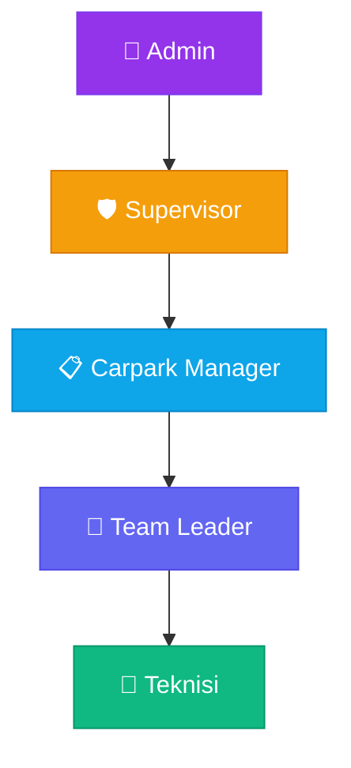
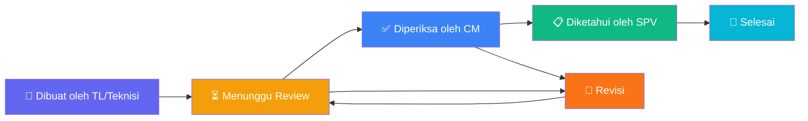

# 📖 Manual Book — LaporPark
### Sistem Manajemen Berita Acara Parkir
**Angkasa Pura Supports — Unit Parkir**

---

> [!NOTE]
> Manual ini mencakup panduan penggunaan aplikasi **LaporPark** untuk seluruh tingkatan pengguna **kecuali Superadmin**. Setiap bagian ditandai dengan role yang memiliki akses terhadap fitur tersebut.

---

## Daftar Isi

1. [Pengenalan Sistem](#1-pengenalan-sistem)
2. [Hierarki Peran Pengguna](#2-hierarki-peran-pengguna)
3. [Login & Autentikasi](#3-login--autentikasi)
4. [Navigasi & Sidebar](#4-navigasi--sidebar)
5. [Panduan per Tingkatan](#5-panduan-per-tingkatan)
   - [5.1 Admin](#51-admin)
   - [5.2 Supervisor](#52-supervisor)
   - [5.3 Carpark Manager](#53-carpark-manager)
   - [5.4 Team Leader](#54-team-leader)
   - [5.5 Teknisi](#55-teknisi)
6. [Fitur Umum — Berita Acara](#6-fitur-umum--berita-acara)
7. [Alur Persetujuan (Approval Workflow)](#7-alur-persetujuan-approval-workflow)
8. [Cetak & PDF](#8-cetak--pdf)
9. [Ganti Password](#9-ganti-password)
10. [Dark Mode / Light Mode](#10-dark-mode--light-mode)
11. [FAQ & Troubleshooting](#11-faq--troubleshooting)

---

## 1. Pengenalan Sistem

**LaporPark** adalah aplikasi web berbasis *Berita Acara* yang digunakan untuk mencatat, melacak, dan menyelesaikan insiden yang terjadi di area parkir bandara di bawah naungan **Angkasa Pura Supports** bekerja sama dengan **Centre Park**.

### Jenis Insiden yang Dicatat:

| Kode | Label | Deskripsi |
|------|-------|-----------|
| `kerusakan` | Kerusakan | Kerusakan fasilitas/infrastruktur parkir |
| `kerusakan_kendaraan` | Kerusakan Kendaraan | Kerusakan yang melibatkan kendaraan |
| `komplain` | Komplain | Keluhan dari pengguna jasa parkir |
| `kehilangan` | Kehilangan | Laporan kehilangan barang/kendaraan |
| `gangguan_sistem` | Gangguan Sistem | Gangguan pada sistem IT/perangkat lunak |
| `gangguan_perangkat` | Gangguan Perangkat | Gangguan pada perangkat keras |
| `lainnya` | Lainnya | Insiden yang tidak termasuk kategori di atas |

### Bandara yang Didukung:

| Kode | Nama Bandara | Lokasi |
|------|-------------|--------|
| AMQ | Bandara Pattimura | Ambon |
| BDJ | Bandara Intl. Syamsudin Noor | Banjarmasin |
| BIK | Bandara Intl. Frans Kaisiepo | Biak |
| BPN | Bandara Intl. Sultan Aji Muhammad Sulaiman | Balikpapan |
| DJJ | Bandara Intl. Sentani | Jayapura |
| DPS | Bandara Intl. I Gusti Ngurah Rai | Denpasar |
| KOE | Bandara Intl. El Tari | Kupang |
| LOP | Bandara Intl. Zainuddin Abdul Madjid | Lombok |
| MDC | Bandara Intl. Sam Ratulangi | Manado |
| SOC | Bandara Intl. Adi Soemarmo | Solo |
| SRG | Bandara Intl. Jenderal Ahmad Yani | Semarang |
| SUB | Bandara Intl. Juanda | Surabaya |
| UPG | Bandara Intl. Sultan Hasanuddin | Makassar |
| YIA | Bandara Intl. Yogyakarta | Yogyakarta |

---

## 2. Hierarki Peran Pengguna

Sistem menggunakan **6 tingkatan peran** (role) dengan hak akses berjenjang. Manual ini mencakup 5 peran berikut (kecuali Superadmin):

### Ringkasan Hak Akses per Role

| Fitur | Admin | Supervisor | Carpark Manager | Team Leader | Teknisi |
|-------|:-----:|:----------:|:---------------:|:-----------:|:-------:|
| **Dashboard Statistik** | ❌ | ✅ | ✅ | ❌ | ❌ |
| **Daftar Berita Acara** | ✅ | ✅ | ✅ | ✅ | ✅ |
| **Buat BA Baru** | ✅ | ✅ | ✅ | ✅ | ✅ |
| **Edit BA** | ❌ | ✅ | ✅ | ❌ | ❌ |
| **Hapus BA** | ❌ | ✅ | ❌ | ❌ | ❌ |
| **Tandai "Diperiksa"** | ❌ | ❌ | ✅ | ❌ | ❌ |
| **Setujui BA** | ❌ | ✅ | ❌ | ❌ | ❌ |
| **Kembalikan ke Revisi** | ❌ | ✅ | ✅ | ❌ | ❌ |
| **Tandai "Selesai"** | ❌ | ✅ | ❌ | ❌ | ❌ |
| **Kelola Foto Lampiran** | ❌ | ✅ | ✅ | ✅* | ✅* |
| **Manajemen Pengguna** | ❌ | ✅ | ❌ | ❌ | ❌ |
| **Cetak / PDF** | ✅ | ✅ | ✅ | ✅ | ✅ |
| **Ganti Password Sendiri** | ✅ | ✅ | ✅ | ✅ | ✅ |

> *\*Team Leader & Teknisi hanya dapat mengelola foto pada BA yang mereka buat sendiri.*

---

## 3. Login & Autentikasi

### 3.1 Halaman Login

Buka aplikasi LaporPark melalui browser. Anda akan disambut dengan halaman login.

**Langkah-langkah:**

1. Masukkan **Email** yang telah didaftarkan oleh Supervisor Anda.
   - Format email: `nama@laporpark.{kode_bandara}.id`
   - Contoh: `budi@laporpark.bdj.id` (Bandara Banjarmasin)

2. Masukkan **Password** Anda.
   - Password default yang diberikan saat pembuatan akun: `123123`
   - Anda dapat mengklik ikon 👁️ mata untuk menampilkan/menyembunyikan password.

3. *(Opsional)* Centang **"Ingat Saya"** agar email dan password tersimpan di browser untuk login berikutnya.

4. Klik tombol **"Masuk"**.

> [!TIP]
> Setelah login pertama kali, segera ubah password default Anda melalui menu **Ganti Password** di sidebar untuk keamanan akun.

### 3.2 Setelah Login Berhasil

Setelah login berhasil, animasi transisi akan muncul dan Anda akan diarahkan ke:
- **Dashboard** — jika role Anda adalah **Supervisor** atau **Carpark Manager**
- **Daftar Berita Acara** — jika role Anda adalah **Admin**, **Team Leader**, atau **Teknisi**

---

## 4. Navigasi & Sidebar

Sidebar adalah panel navigasi utama yang terletak di sisi kiri layar (desktop) atau dapat diakses melalui ikon ☰ hamburger (mobile).

### Menu yang Tampil Berdasarkan Role:

| Menu | Icon | Admin | Supervisor | Carpark Manager | Team Leader | Teknisi |
|------|------|:-----:|:----------:|:---------------:|:-----------:|:-------:|
| Dashboard | 📊 | ❌ | ✅ | ✅ | ❌ | ❌ |
| Daftar Berita Acara | 📄 | ✅ | ✅ | ✅ | ✅ | ✅ |
| Buat BA Baru | ➕ | ✅ | ✅ | ✅ | ✅ | ✅ |
| Manajemen Pengguna | 👥 | ❌ | ✅ | ❌ | ❌ | ❌ |

### Informasi di Sidebar:
- **Nama Pengguna** — nama lengkap yang terdaftar
- **Role** — tingkatan/jabatan Anda di sistem
- **Bandara** — lokasi bandara tempat Anda bertugas
- **Tombol Ganti Password** — untuk mengubah password
- **Tombol Theme** — beralih antara mode terang dan gelap
- **Tombol Keluar** — logout dari sistem

---

## 5. Panduan per Tingkatan

---

### 5.1 Admin

> **Tingkatan:** Paling tinggi dalam manual ini (di bawah Superadmin)

| Akses | Keterangan |
|-------|------------|
| Dashboard | ❌ Tidak tersedia |
| Daftar BA | ✅ Melihat semua BA di bandara sendiri |
| Buat BA Baru | ✅ Dapat membuat laporan insiden |
| Edit BA | ❌ Tidak tersedia |
| Hapus BA | ❌ Tidak tersedia |
| Approval | ❌ Tidak tersedia |
| Manajemen Pengguna | ❌ Tidak tersedia |

**Halaman Utama setelah Login:** Daftar Berita Acara

**Panduan Penggunaan:**
1. Gunakan menu **Daftar Berita Acara** untuk melihat seluruh laporan BA di bandara Anda.
2. Gunakan menu **Buat BA Baru** untuk membuat laporan insiden baru.
3. Lihat detail setiap BA dengan mengklik nomor BA atau judul masalah.
4. Cetak BA menggunakan tombol **Print/PDF** pada halaman detail.

---

### 5.2 Supervisor

> **Tingkatan:** Kepala operasional bandara — memiliki akses paling luas di tingkat cabang

| Akses | Keterangan |
|-------|------------|
| Dashboard | ✅ Statistik lengkap bandara sendiri |
| Daftar BA | ✅ Melihat semua BA di bandara sendiri |
| Buat BA Baru | ✅ BA langsung berstatus **"Diketahui"** |
| Edit BA | ✅ Dapat mengedit BA (selama belum Diketahui/Selesai) |
| Hapus BA | ✅ Dapat menghapus BA |
| Setujui BA | ✅ Menandai BA sebagai **"Diketahui"** |
| Tandai Selesai | ✅ Menandai BA sebagai **"Selesai"** |
| Revisi | ✅ Mengembalikan BA untuk diperbaiki |
| Kelola Foto | ✅ Menambah/menghapus foto lampiran |
| Manajemen Pengguna | ✅ CRUD pengguna di bandara sendiri |

**Halaman Utama setelah Login:** Dashboard

#### 5.2.1 Dashboard

Dashboard menampilkan ringkasan statistik berikut:

- **Kartu Statistik:**
  - Jumlah BA berstatus **Diperiksa**
  - Jumlah BA berstatus **Revisi**
  - Jumlah BA berstatus **Selesai**
  - **Total BA** keseluruhan

- **Quick Actions:**
  - 🆕 Buat Berita Acara Baru
  - 📋 Lihat Semua BA

- **Berita Acara Terbaru:** 5 BA terakhir beserta nomor, status, judul, dan pembuat.

#### 5.2.2 Tindakan Persetujuan (Approval)

Pada halaman detail BA, Supervisor memiliki panel tindakan berikut:

| Status BA Saat Ini | Tindakan yang Tersedia |
|---------------------|----------------------|
| Menunggu Review | ✅ Setujui BA · ✅ Kembalikan untuk Revisi |
| Diperiksa | ✅ Setujui BA · ✅ Kembalikan untuk Revisi |
| Revisi | ✅ Setujui BA |
| Diketahui | ✅ Tandai Selesai |
| Selesai | *(tidak ada tindakan)* |

**Cara Menyetujui BA:**
1. Buka halaman **Daftar Berita Acara**.
2. Klik nomor BA atau judul untuk membuka detail.
3. Pada panel **"Tindakan"** di bagian atas, klik tombol yang sesuai:
   - 🟢 **"Setujui Berita Acara"** — Mengubah status menjadi *Diketahui*
   - 🔵 **"Tandai Selesai"** — Mengubah status menjadi *Selesai* (hanya jika sudah Diketahui)
   - 🔴 **"Kembalikan untuk Revisi"** — Mengembalikan BA ke pembuat untuk diperbaiki

#### 5.2.3 Edit Berita Acara

1. Buka halaman detail BA.
2. Klik tombol **"Edit"** di bagian kanan atas.
3. Ubah field yang diperlukan (Judul, Kronologi, Tindakan, Penyelesaian, Mitigasi, dll).
4. Klik **"Simpan"** untuk menyimpan perubahan.

> [!IMPORTANT]
> BA yang sudah berstatus **"Diketahui"** atau **"Selesai"** **tidak dapat diedit** kecuali foto lampiran.

#### 5.2.4 Hapus Berita Acara

1. Buka halaman detail BA.
2. Klik tombol **"Hapus"** (ikon 🗑️) di bagian kanan atas.
3. Konfirmasi penghapusan pada dialog yang muncul.

> [!CAUTION]
> Penghapusan BA bersifat **permanen** dan tidak dapat dikembalikan. Pastikan Anda benar-benar yakin sebelum menghapus.

#### 5.2.5 Manajemen Pengguna

Supervisor dapat mengelola akun pengguna di bandara mereka.

**Akses:** Menu sidebar → **Manajemen Pengguna**

**Fitur yang Tersedia:**

| Fitur | Deskripsi |
|-------|-----------|
| 👀 Lihat Daftar Pengguna | Melihat semua pengguna di bandara sendiri |
| ➕ Buat Pengguna Baru | Membuat akun baru untuk anggota tim |
| ✏️ Edit Profil Pengguna | Mengubah nama, email, dan tanda tangan |
| 🔑 Reset Password | Mengubah password pengguna lain |
| 🗑️ Hapus Pengguna | Menghapus akun pengguna |

**Cara Membuat Pengguna Baru:**
1. Klik tombol **"Buat Pengguna Baru"**.
2. Isi form yang muncul:
   - **Nama Lengkap** — nama pengguna baru
   - **Email** — harus menggunakan format `nama@laporpark.{kode_bandara}.id`
   - **Password** — opsional (default: `123123`)
   - **Role** — pilih tingkatan akses: Team Leader, Teknisi, Carpark Manager, dll.
   - **Tanda Tangan** — opsional, upload gambar tanda tangan digital
3. Klik **"Simpan"**.

> [!WARNING]
> Supervisor **hanya dapat membuat pengguna untuk bandara sendiri**. Email harus menggunakan domain bandara yang sesuai (contoh: `@laporpark.bdj.id` untuk Banjarmasin).

---

### 5.3 Carpark Manager

> **Tingkatan:** Manajer operasional — bertanggung jawab memeriksa dan memverifikasi BA

| Akses | Keterangan |
|-------|------------|
| Dashboard | ✅ Statistik bandara sendiri |
| Daftar BA | ✅ Melihat semua BA di bandara sendiri |
| Buat BA Baru | ✅ BA langsung berstatus **"Diperiksa"** |
| Edit BA | ✅ Dapat mengedit BA (selama belum Diketahui/Selesai) |
| Hapus BA | ❌ Tidak tersedia |
| Tandai Diperiksa | ✅ Menandai BA telah diperiksa |
| Revisi | ✅ Mengembalikan BA untuk diperbaiki |
| Kelola Foto | ✅ Menambah/menghapus foto lampiran |
| Manajemen Pengguna | ❌ Tidak tersedia |

**Halaman Utama setelah Login:** Dashboard

#### 5.3.1 Tindakan Carpark Manager

Pada halaman detail BA, Carpark Manager memiliki panel tindakan berikut:

| Status BA Saat Ini | Tindakan yang Tersedia |
|---------------------|----------------------|
| Menunggu Review | ✅ Tandai Telah Diperiksa · ✅ Kembalikan untuk Revisi |
| Revisi | ✅ Tandai Telah Diperiksa |
| Diperiksa / Diketahui / Selesai | *(tidak ada tindakan tambahan)* |

**Cara Menandai BA Telah Diperiksa:**
1. Buka halaman detail BA yang berstatus **"Menunggu Review"** atau **"Revisi"**.
2. Pada panel **"Tindakan"**, klik tombol 🔵 **"Tandai Telah Diperiksa"**.
3. Status BA akan berubah menjadi **"Diperiksa"** dan menunggu persetujuan Supervisor.

#### 5.3.2 Perbedaan Status Awal BA

Ketika Carpark Manager **membuat BA baru**, status awal BA akan otomatis menjadi **"Diperiksa"** (melewati tahap Menunggu Review), karena pembuatan oleh CM dianggap sudah melalui tahap pemeriksaan.

---

### 5.4 Team Leader

> **Tingkatan:** Pemimpin tim lapangan — pengguna utama pembuat laporan BA

| Akses | Keterangan |
|-------|------------|
| Dashboard | ❌ Tidak tersedia |
| Daftar BA | ✅ Melihat semua BA di bandara sendiri |
| Buat BA Baru | ✅ BA berstatus **"Menunggu Review"** |
| Edit BA | ❌ Tidak tersedia |
| Hapus BA | ❌ Tidak tersedia |
| Approval | ❌ Tidak tersedia |
| Kelola Foto | ✅ Hanya pada BA yang dibuat sendiri |
| Manajemen Pengguna | ❌ Tidak tersedia |

**Halaman Utama setelah Login:** Daftar Berita Acara

#### 5.4.1 Membuat Berita Acara Baru

Ini adalah tugas utama Team Leader — melaporkan insiden yang terjadi di lapangan.

**Langkah-langkah:**
1. Klik menu **"Buat BA Baru"** di sidebar, atau tombol **"Buat BA Baru"** di halaman Daftar BA.
2. Isi form berikut:

| Field | Deskripsi | Wajib |
|-------|-----------|:-----:|
| Tanggal Kejadian | Tanggal insiden terjadi | ✅ |
| Waktu Kejadian | Jam insiden terjadi | ✅ |
| Lokasi / Zona | Area spesifik di parkir bandara | ✅ |
| Jenis Insiden | Pilih dari dropdown kategori | ✅ |
| Pihak Terlibat | Nama/pihak yang terlibat (jika ada) | ❌ |
| Judul Masalah | Ringkasan singkat insiden | ✅ |
| Kronologi | Uraian lengkap kejadian | ✅ |
| Tindakan yang Dilakukan | Langkah yang sudah diambil | ✅ |
| Penyelesaian | Hasil penyelesaian insiden | ✅ |
| Mitigasi | Langkah pencegahan ke depan | ✅ |
| Lampiran Foto | Upload foto bukti/dokumentasi | ❌ |

3. *(Opsional)* Klik tombol **✨ AI Cleanup** untuk merapikan teks kronologi, tindakan, penyelesaian, dan mitigasi secara otomatis menggunakan AI.
   - Setelah AI menerapkan perubahan, tombol **↩️ Undo** akan muncul untuk mengembalikan teks asli.

4. *(Opsional)* Klik tombol **👁️ Preview** untuk melihat tampilan BA sebelum dikirim.

5. Klik tombol **"Kirim Berita Acara"** untuk mengirim.

> [!NOTE]
> BA yang dibuat oleh Team Leader akan otomatis mendapatkan status **"Menunggu Review"** dan menunggu pemeriksaan oleh Carpark Manager.

> [!TIP]
> **Nomor BA** akan di-generate otomatis dengan format: `BA/PARKIR/{KODE_BANDARA}/{TAHUN}/{BULAN}/{NOMOR_URUT}`
> Contoh: `BA/PARKIR/BDJ/2026/09/0001`

#### 5.4.2 Menambah Foto pada BA yang Sudah Dibuat

1. Buka halaman detail BA yang Anda buat.
2. Pada bagian **"Lampiran Foto"**, klik tombol **"Kelola Foto"**.
3. Upload foto baru atau hapus foto yang ada.
4. Klik **"Simpan"**.

> [!TIP]
> Fitur kelola foto tetap tersedia meskipun BA sudah berstatus "Diketahui" atau "Selesai", selama Anda adalah pembuat BA tersebut.

---

### 5.5 Teknisi

> **Tingkatan:** Staf teknis lapangan — akses sama dengan Team Leader

| Akses | Keterangan |
|-------|------------|
| Dashboard | ❌ Tidak tersedia |
| Daftar BA | ✅ Melihat semua BA di bandara sendiri |
| Buat BA Baru | ✅ BA berstatus **"Menunggu Review"** |
| Edit BA | ❌ Tidak tersedia |
| Hapus BA | ❌ Tidak tersedia |
| Approval | ❌ Tidak tersedia |
| Kelola Foto | ✅ Hanya pada BA yang dibuat sendiri |
| Manajemen Pengguna | ❌ Tidak tersedia |

**Halaman Utama setelah Login:** Daftar Berita Acara

Panduan penggunaan Teknisi **identik dengan Team Leader** (lihat [Bagian 5.4](#54-team-leader)). Perbedaan hanya pada label role yang ditampilkan di sidebar.

---

## 6. Fitur Umum — Berita Acara

Fitur-fitur berikut tersedia untuk **semua role**.

### 6.1 Melihat Daftar Berita Acara

**Menu:** Sidebar → **Daftar Berita Acara**

Halaman ini menampilkan seluruh BA di bandara Anda dengan fitur:

- **🔍 Pencarian** — Cari berdasarkan judul masalah atau nomor BA
- **📊 Filter Status** — Filter berdasarkan status: Semua, Draft, Menunggu Review, Diperiksa, Revisi, Diketahui, Selesai
- **📋 Tabel/Kartu** — Tampilan tabel (desktop) atau kartu (mobile)
- **📄 Pagination** — Navigasi halaman (10 item per halaman)

### 6.2 Melihat Detail Berita Acara

Klik pada **Nomor BA** atau **Judul Masalah** dari daftar untuk membuka halaman detail yang berisi:

- **Header:** Nomor BA, status, judul masalah
- **Info Meta:**
  - 🏢 Bandara
  - 📅 Tanggal kejadian
  - 🕐 Waktu kejadian
  - 📍 Lokasi/Zona
  - 🏷️ Jenis insiden
- **Pihak Terlibat** (jika ada)
- **Detail Narasi:**
  - Kronologi
  - Tindakan yang Dilakukan
  - Penyelesaian
  - Mitigasi
- **Lampiran Foto** — galeri foto dokumentasi
- **Informasi Pelapor:**
  - Dibuat oleh (nama + role + tanggal)
  - Diperiksa oleh (Carpark Manager + tanggal)
  - Mengetahui (Supervisor + tanggal)
- **Riwayat Perubahan** — log audit setiap perubahan pada BA

### 6.3 Status Berita Acara

Setiap BA memiliki status yang menunjukkan posisinya dalam alur persetujuan:

| Status | Warna Badge | Deskripsi |
|--------|:-----------:|-----------|
| Draft | ⬜ Abu-abu | BA masih dalam draft (belum digunakan secara aktif) |
| Menunggu Review | 🟡 Kuning | BA baru dibuat, menunggu pemeriksaan CM |
| Diperiksa | 🔵 Biru | CM sudah memeriksa, menunggu persetujuan Supervisor |
| Revisi | 🟠 Oranye | BA dikembalikan untuk diperbaiki oleh pembuat |
| Diketahui | 🟢 Hijau | Supervisor sudah menyetujui BA |
| Selesai | ✅ Teal | BA telah selesai dan ditutup |

---

## 7. Alur Persetujuan (Approval Workflow)

Berikut adalah alur standar sebuah Berita Acara dari pembuatan hingga selesai:

### Alur Detail:

1. **Team Leader / Teknisi** membuat BA baru → status otomatis **"Menunggu Review"**
2. **Carpark Manager** memeriksa BA:
   - Jika sesuai → klik **"Tandai Telah Diperiksa"** → status menjadi **"Diperiksa"**
   - Jika perlu perbaikan → klik **"Kembalikan untuk Revisi"** → status menjadi **"Revisi"**
3. **Supervisor** mereview BA yang sudah diperiksa:
   - Jika setuju → klik **"Setujui Berita Acara"** → status menjadi **"Diketahui"**
   - Jika perlu perbaikan → klik **"Kembalikan untuk Revisi"** → status menjadi **"Revisi"**
4. **Supervisor** menandai BA yang sudah disetujui → klik **"Tandai Selesai"** → status menjadi **"Selesai"**

### Alur Khusus:

| Pembuat BA | Status Awal |
|------------|-------------|
| Team Leader | Menunggu Review |
| Teknisi | Menunggu Review |
| Carpark Manager | Diperiksa (melewati tahap review) |
| Supervisor | Diketahui (melewati tahap review dan periksa) |

---

## 8. Cetak & PDF

Semua pengguna dapat mencetak BA dalam format dokumen resmi.

**Cara Mencetak:**
1. Buka halaman **Detail Berita Acara**.
2. Klik tombol **"Print/PDF"** di bagian kanan atas.
3. Jendela cetak browser akan terbuka.
4. Pilih **printer** atau pilih **"Save as PDF"** untuk menyimpan sebagai file PDF.

**Layout cetak** akan menampilkan format dokumen resmi lengkap dengan:
- Kop surat Angkasa Pura Supports & Centre Park
- Nomor BA
- Seluruh detail insiden
- Tanda tangan digital (jika tersedia):
  - Yang Membuat (pembuat BA)
  - Yang Memeriksa (Carpark Manager)
  - Mengetahui (Supervisor)

---

## 9. Ganti Password

Semua pengguna dapat mengubah password mereka sendiri.

**Cara Ganti Password:**
1. Pada sidebar, klik tombol **"Ganti Password"** (ikon 🔑).
2. Modal akan muncul dengan form:
   - **Password Baru** — minimal 6 karakter
   - **Konfirmasi Password** — ketik ulang password baru
3. Klik **"Simpan"**.

> [!WARNING]
> Setelah mengganti password, password display yang terlihat di Manajemen Pengguna **tidak akan otomatis terupdate** kecuali password diubah melalui Manajemen Pengguna oleh Supervisor.

---

## 10. Dark Mode / Light Mode

LaporPark mendukung tema **gelap** dan **terang**.

**Cara Mengganti Tema:**

- **Desktop:** Klik ikon 🌙/☀️ di bagian bawah sidebar.
- **Mobile:** Klik ikon tema di header bar atas.

Tema akan langsung diterapkan tanpa perlu refresh halaman.

---

## 11. FAQ & Troubleshooting

### ❓ Saya tidak bisa login

- Pastikan email dan password sudah benar.
- Pastikan format email sesuai: `nama@laporpark.{kode_bandara}.id`
- Hubungi Supervisor Anda untuk memastikan akun sudah dibuat.
- Jika masih gagal, minta Supervisor untuk melakukan reset password.

### ❓ Saya tidak bisa melihat Dashboard

Dashboard hanya tersedia untuk role **Supervisor** dan **Carpark Manager**. Jika Anda adalah Team Leader, Teknisi, atau Admin, Anda akan langsung diarahkan ke Daftar Berita Acara.

### ❓ Saya tidak bisa mengedit BA

Hanya **Carpark Manager** dan **Supervisor** yang dapat mengedit BA. Selain itu, BA yang sudah berstatus **"Diketahui"** atau **"Selesai"** tidak dapat diedit.

### ❓ Saya tidak bisa melihat BA dari bandara lain

Ini adalah fitur **Isolasi Multi-Cabang**. Setiap pengguna hanya dapat melihat BA dari bandara tempat mereka ditugaskan. Ini dikendalikan berdasarkan kode bandara di email Anda.

### ❓ Tombol approval tidak muncul di halaman detail BA

Tombol approval hanya tampil sesuai role dan status BA saat ini. Lihat [Bagian 7](#7-alur-persetujuan-approval-workflow) untuk alur lengkapnya.

### ❓ Saya ingin menambahkan foto tapi tombol "Kelola Foto" tidak muncul

Tombol ini muncul jika:
- Anda adalah **Supervisor**, **Carpark Manager**, atau
- Anda adalah **pembuat BA tersebut** (Team Leader/Teknisi)

### ❓ Nomor BA tidak berurut

Nomor BA digenerate otomatis berdasarkan **bulan dan tahun** saat BA dibuat. Jika ada BA yang dihapus, nomor tersebut tidak akan dipakai ulang.

---

> [!NOTE]
> **Versi Manual:** 1.0 — September 2026
> **Aplikasi:** LaporPark — Sistem Manajemen Berita Acara Parkir
> **Organisasi:** Angkasa Pura Supports × Centre Park
